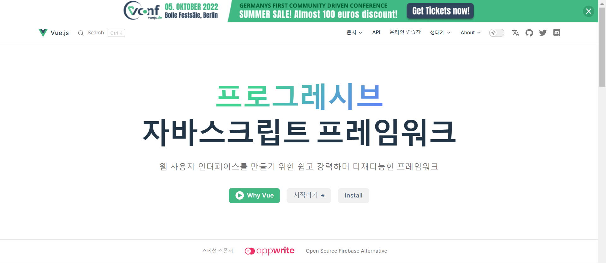

# vue.js-study
[Vue.js 사이트](https://v3-docs.vuejs-korea.org/)

## CDN
CDN 을 이용하여 연결할 수 있지만, npm 을 사용해서 연결하는 것이 좋다.
- CDN 연결 방법
```html
<script src="https://unpkg.com/vue@next"></script>
```
## npm
### :one: 시작하기
전체 영역에서 vue 를 사용할 수 있도록 전역 설치(-g)
```s
$ npm i -g @vue/cli
```
### :two vue create
```s
$ vue create vue3-test
$ cd vue3-test
```